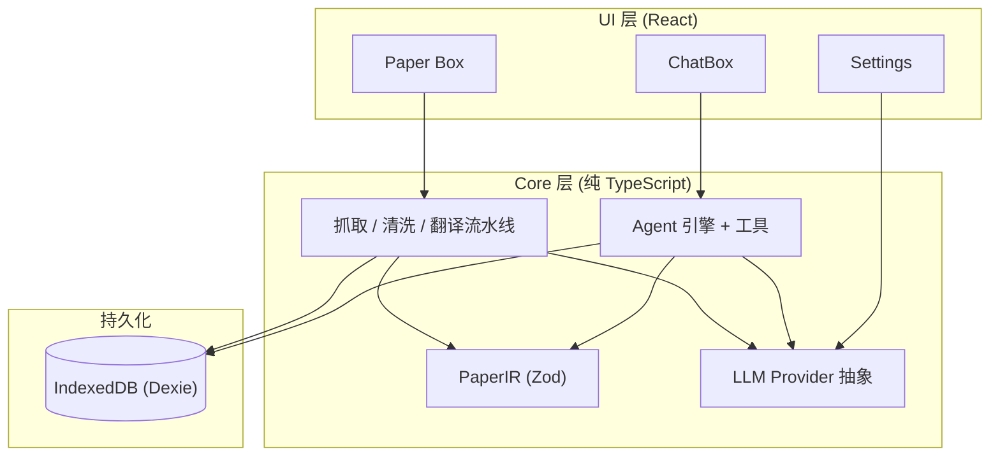
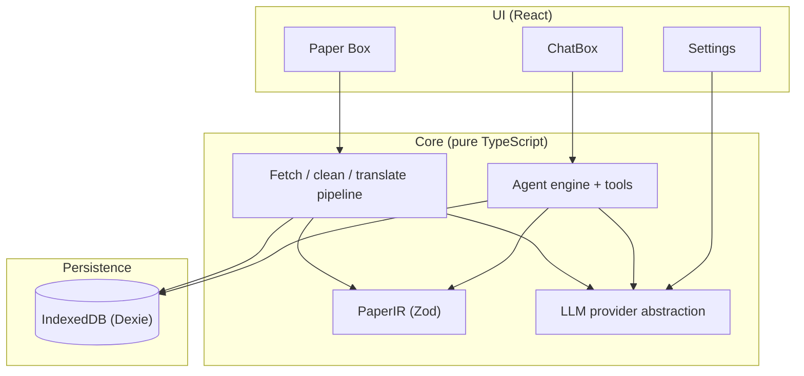

<div align="center">


# ResearchBox

### 🔬 你的浏览器里的学术研究 Agent —— 检索、精读、翻译、产出，一条龙

**纯前端 · 本地优先 · 自带 LLM（BYOK）的开源学术 Agent 框架 & 论文工具箱**

<p>
<a href="https://www.typescriptlang.org/"></a>
<a href="https://react.dev/"></a>
<a href="https://vite.dev/"></a>
<a href="https://web.dev/progressive-web-apps/"></a>
<a href="#许可证"></a>
</p>

<p>
<a href="https://github.com/Phantivia/ResearchBox/stargazers"></a>
<a href="https://github.com/Phantivia/ResearchBox/network/members"></a>
<a href="https://github.com/Phantivia/ResearchBox/issues"></a>
<a href="https://github.com/Phantivia/ResearchBox/commits"></a>
</p>

[**🌐 在线体验**](https://phantivia.github.io/ResearchBox/) · [**⚡ 快速开始**](#-快速开始) · [**✨ 特性**](#-核心特性) · [**🗺️ 路线图**](#️-路线图) · [**🤝 贡献**](#-参与贡献)

**简体中文** · [English](#researchbox-english)

</div>

---

> [!TIP]
> **无需安装，30 秒上手：** 打开 [GitHub Pages 在线体验](https://phantivia.github.io/ResearchBox/) → 设置页填入你的 LLM API Key → 创建项目即可开聊。数据全程留在你自己的浏览器里。

ResearchBox 是一款**面向研究人员的开源、纯前端 PWA**：把「文献调研 Agent」和「论文阅读/翻译工具箱」装进同一个浏览器标签页。无后端、无账号、无厂商锁定——克隆即跑，部署为静态站点即可。

- 🧠 **ChatBox** —— 为学术场景打造的 Research Agent 运行时：多轮工具循环、流式推理、子 Agent、Artifact 持久化。
- 📚 **Paper Box** —— Agent 的知识底座：arXiv 一键导入、结构化 IR、AI 流式翻译、原文/译文/双语阅读与标注。

二者共享 **PaperIR**（Zod 定义的中央数据格式）与 `paperId#blockId` 引用体系，以**项目（工作区）**为顶层组织单位。

---

## ⚡ 快速开始

> **环境要求：** Node.js 18+ 与 npm

```bash
git clone https://github.com/Phantivia/ResearchBox.git
cd ResearchBox
npm install
npm run dev
```

打开浏览器中的本地地址，三步开干：

1. **配置 LLM** —— 设置页填入 Provider 与 API Key（可选：Semantic Scholar / OpenAlex / Web 搜索 Key）。
2. **创建项目** —— 默认进入 ChatBox，开始文献调研对话。
3. **导入论文** —— 切到 Paper Box 粘贴 arXiv 链接；Agent 即可检索、精读已入库内容。

<details>
<summary><b>📦 生产构建与静态部署</b></summary>

```bash
npm run build        # 类型检查 + 生产构建
npm run build:pages  # GitHub Pages 构建（相对路径 base）
npm run preview      # 本地预览构建产物
```

纯静态产物，可一键部署到 GitHub Pages / Cloudflare Pages / Vercel，无需任何服务器运维。

</details>

---

## ✨ 核心特性

| | 特性 | 说明 |
|---|------|------|
| 🧠 | **Research Agent 引擎** | `runAgent` 多轮工具循环、流式输出、工具审批、子 Agent、超大结果分页；核心以框架无关纯 TypeScript 实现，可单测、可复用 |
| 📚 | **学术工具集** | Paper Box 检索、语义 block 检索、OpenAlex / Semantic Scholar 搜索、论文推荐入库、Artifact 持久化 |
| 🔀 | **采集 / 研究双模式** | 「盒子打开」向外搜索并推荐论文；「盒子关闭」后 Agent 仅在已整理的 Paper Box 内工作，边界清晰、可审计 |
| 📄 | **Paper Box 阅读器** | arXiv 一键导入、规则清洗 HTML、KaTeX 数学、流式翻译与断点续传、划词标注与引用弹窗 |
| 🔑 | **自带 LLM（BYOK）** | OpenAI、Anthropic、Gemini、DeepSeek、OpenRouter、SiliconFlow 等，用户填写 API Key，无厂商锁定 |
| 💾 | **本地优先** | IndexedDB 持久化论文、会话与 Artifact；可安装为 PWA，支持离线阅读 |
| 🐍 | **可选扩展能力** | Pyodide Python 沙箱、Tavily / Perplexity Web 搜索、客户端 OCR（tesseract.js），均可单独开关并支持审批 |
| 🧩 | **可扩展架构** | `src/core/` 与 UI 严格分离；IR 的 Zod schema 为唯一事实来源 |

---

## 💡 它能帮你做什么

| 场景 | 你只需要说 |
|------|-----------|
| **快速文献综述** | “围绕『扩散模型加速采样』检索近两年代表作，推荐 5 篇入库并给我一份综述大纲。” |
| **论文精读 + 对比** | “把盒子里这三篇 RAG 论文的检索器设计做成一张对比表。” |
| **流式翻译长论文** | 粘贴 arXiv 链接 → 一键生成原文 / 译文 / 双语对照视图，支持断点续传 |
| **带证据的问答** | “这篇论文是怎么处理长上下文的？引用具体段落。”（结果带 `paperId#blockId` 溯源） |
| **跑点小实验** | “用 Python 把这张表里的实验数据画成折线图。”（Pyodide 沙箱，需审批） |
| **沉淀研究产出** | Agent 把综述 / 对比表 / 大纲 / 笔记保存为 Artifact，持久化到 IndexedDB |

---

## 🏗️ 架构



**设计原则**（详见 [`CLAUDE.md`](./CLAUDE.md)）：`src/core/` 不依赖 React，可被 Vitest 单测；UI 只调用 core 暴露的 API，禁止反向依赖；所有论文数据读写均经 PaperIR schema，不得另立 interface。

---

## 🤖 ChatBox：Research Agent

ChatBox 不是通用聊天壳，而是围绕**文献调研、论文精读、研究产出**设计的 Agent 运行时。

<details open>
<summary><b>核心能力</b></summary>

| 能力 | 说明 |
|------|------|
| **多轮工具循环** | LLM 调用工具 → 执行 → 结果回注 → 继续推理；并发安全工具可并行（上限 4） |
| **流式体验** | 文本、thinking 块、Python 代码、工具卡片实时渲染；后台运行，切页不中断 |
| **工具审批** | Web 搜索、Python、Artifact 写入等敏感操作可配置自动放行或逐项确认 |
| **子 Agent** | `paper-summarizer` / `reviewer` 等专用子任务，独立模型与推理强度 |
| **多模态输入** | 粘贴/拖拽图片，客户端 OCR 提取文字送入对话 |
| **会话持久化** | 历史搜索、重命名、置顶、删除；Artifact 独立浏览页 |
| **上下文计量** | Token 用量条与详情，帮助控制长对话成本 |

</details>

<details>
<summary><b>Agent 工具集</b>（由 <code>buildResearchTools()</code> 组装）</summary>

| 工具 | 用途 |
|------|------|
| `paperbox_list` | 列出当前项目已入库论文 |
| `paperbox_read` | 读取 meta / abstract / outline / full |
| `paperbox_fetch` | 全文紧凑纯文本（含 `paperId#blockId` 锚点） |
| `retrieval` | 对 Paper Box 内 blocks 做语义检索（位图预过滤 + LLM side-query） |
| `academic_search` | 外部学术搜索（OpenAlex → Semantic Scholar，可补全摘要） |
| `recommend_papers` | 向用户展示论文推荐卡片，确认后入库 |
| `artifacts` | 保存研究产出（summary / compare-table / outline / note）到 IndexedDB |
| `sub_agent` | 启动子 Agent 执行专项任务 |
| `fetch_result` | 加载超大工具结果的完整内容 |
| `websearch` * | Tavily / Perplexity Web 搜索（需开启 `allowWeb`） |
| `python` * | Pyodide WASM 沙箱执行 Python（需开启 `allowCode`） |

\* 可在设置中开关；涉及外部网络或代码执行的操作支持审批流程。

</details>

**采集 vs 研究** —— 关闭盒子时插入边界标记，Agent 系统 Prompt 与可用工具集同步切换，适合「先广泛搜集，再聚焦已有文献」的研究节奏：

```
┌─────────────────────────────────────────────────────────┐
│  盒子打开（采集）          │  盒子关闭（研究）            │
│  外部 academic_search      │  仅 Paper Box 内检索         │
│  Web 搜索 + 推荐入库       │  retrieval / read / fetch    │
│  扩充论文库                │  写 Artifact、跑 Python      │
└─────────────────────────────────────────────────────────┘
```

---

## 📖 Paper Box：论文阅读与翻译

Agent 的论文库建立在 **PaperIR** 之上：

- 📥 **一键导入 arXiv** —— 支持 `arxiv.org/abs|pdf|html/...` 与裸 ID（含版本号），自动选源与回退
- 🧼 **干净的正文** —— 规则清洗 HTML，保留标题层级、公式、图表与引用；**零 LLM 成本**
- 🌐 **原文 / 译文 / 双语** —— 分块流式翻译，先出结构后补内容；**断点续传**
- ∑ **KaTeX 数学渲染** —— 公式密集页面稳定排版
- ✍️ **划词标注** —— 高亮与笔记持久化，跨会话保留
- 🔗 **引用弹窗** —— 点击文中引用原地查看参考文献
- 🗂️ **多项目隔离** —— 论文条目与标注按项目隔离；`PaperIR` 内容跨项目共享缓存

---

## 🆚 为什么选择 ResearchBox

| 维度 | ResearchBox |
|------|-------------|
| **定位** | 学术研究 Agent + 论文工具箱，而非通用 ChatGPT 壳 |
| **部署** | 纯静态 SPA —— GitHub Pages / Cloudflare Pages / Vercel，无服务器运维 |
| **数据** | IndexedDB 本地持久化，论文、会话、Artifact 不上传 |
| **LLM** | BYOK，多 Provider 统一抽象 |
| **可扩展** | 框架无关 `src/core/`，Agent 工具、IR、流水线均可单测与二次开发 |

---

## 🛠️ 技术栈

| 层次 | 技术 |
|------|------|
| 框架 | React 19 · Vite 6 · TypeScript strict |
| 状态 | Zustand |
| 持久化 | Dexie.js (IndexedDB) |
| 校验 | Zod |
| 样式 | Tailwind CSS |
| 数学 / 安全 | KaTeX · DOMPurify |
| Agent 扩展 | Pyodide · tesseract.js |
| 测试 | Vitest · Playwright |

---

## 🧪 开发与测试

```bash
npm run typecheck         # TypeScript 类型检查
npm run test              # Vitest 单元测试
npm run test:watch        # Vitest watch 模式
npm run test:e2e          # Playwright E2E
npm run test:e2e:install  # 安装 Playwright Chromium（首次 E2E 前执行）
```

架构约定、模块边界与 Agent 实现细节见 [`PROJECT.md`](./PROJECT.md) 与 [`CLAUDE.md`](./CLAUDE.md)。

---

## 🗺️ 路线图

- [x] **Phase 0** —— 骨架：项目、存储与 IR 数据模型
- [x] **Phase 1** —— Paper Box 只读链路：arXiv 导入 → 清洗 → 渲染 + 数学
- [x] **Phase 2** —— 翻译流水线：结构化 IR + 流式译文 + 断点续传 + 双语视图
- [x] **Phase 3** —— 阅读体验：标注持久化、引用弹窗
- [x] **Phase 4** —— ChatBox Research Agent：工具循环、学术搜索、检索、Artifact、子 Agent、Python 沙箱
- [ ] **Phase 5** —— 打磨与上架：离线体验优化、配额管理、安卓 TWA 打包
- [ ] **未来** —— PDF 导入管线、Skills 菜单接入、更多子 Agent 类型

---

## ❓ 常见问题

<details>
<summary><b>需要后端服务器吗？</b></summary>

不需要。ResearchBox 是 100% 纯前端 PWA，所有逻辑跑在浏览器里，部署为静态站点即可。

</details>

<details>
<summary><b>我的 API Key 和论文数据安全吗？</b></summary>

数据全程留在你的设备上：API Key、论文、会话与 Artifact 都存在浏览器的 IndexedDB / 本地存储中，不经过任何第三方服务器（除你自己配置的 LLM / 搜索 Provider）。

</details>

<details>
<summary><b>支持哪些 LLM？</b></summary>

BYOK 模式下统一抽象了 OpenAI、Anthropic、Gemini、DeepSeek、OpenRouter、SiliconFlow 等 Provider，填入对应 API Key 即可使用。

</details>

<details>
<summary><b>除了 arXiv 还支持别的来源吗？</b></summary>

当前导入管线聚焦 arXiv（链接与裸 ID）。PDF 导入管线已列入路线图。

</details>

---

## 📚 文档

| 文档 | 内容 |
|------|------|
| [`ResearchBox-技术手册.md`](./ResearchBox-技术手册.md) | 产品定位、功能说明、用户向技术细节 |
| [`PROJECT.md`](./PROJECT.md) | 开发手册：目录结构、模块接口、Agent 架构 |
| [`CLAUDE.md`](./CLAUDE.md) | 贡献约定与技术栈铁律 |

---

## 🤝 参与贡献

欢迎 Issue 与 Pull Request。提交前请确保：

1. 遵守 [`CLAUDE.md`](./CLAUDE.md) 中的架构铁律（core/UI 分离、PaperIR 为唯一 schema 来源）
2. 本地通过 `npm run typecheck` 与 `npm run test`
3. 涉及 Agent 或 core 模块的改动，补充或更新同名 `.test.ts`

---

## ⭐ Star History

<div align="center">

<a href="https://www.star-history.com/#Phantivia/ResearchBox&Date">
  
</a>

<sub>如果 ResearchBox 帮到了你的研究，欢迎点一颗 ⭐ 让更多人看到。</sub>

</div>

---

## 📄 许可证

**PhantAIStudio** 出品

- **Author:** [Phantivia](mailto:phantivia@gmail.com)
- **License:** [MIT](./LICENSE)

<div align="center">

<sub>Vibe Coiding太好用了，你们知道吗？———— Phant(除了这句话之外没有写任何东西之人)</sub>

[⬆ 回到顶部](#researchbox) · [English](#researchbox-english)

</div>

---

<a id="researchbox-english"></a>

<div align="center">


# ResearchBox

### 🔬 An academic research Agent that lives in your browser — search, read, translate, ship

**An open-source, frontend-only, local-first, BYOK Agent framework & paper toolbox for researchers**

<p>
<a href="https://www.typescriptlang.org/"></a>
<a href="https://react.dev/"></a>
<a href="https://vite.dev/"></a>
<a href="https://web.dev/progressive-web-apps/"></a>
<a href="#license"></a>
</p>

<p>
<a href="https://github.com/Phantivia/ResearchBox/stargazers"></a>
<a href="https://github.com/Phantivia/ResearchBox/network/members"></a>
<a href="https://github.com/Phantivia/ResearchBox/issues"></a>
<a href="https://github.com/Phantivia/ResearchBox/commits"></a>
</p>

[**🌐 Live Demo**](https://phantivia.github.io/ResearchBox/) · [**⚡ Quick Start**](#-quick-start) · [**✨ Features**](#-key-features) · [**🗺️ Roadmap**](#️-roadmap) · [**🤝 Contributing**](#-contributing)

[简体中文](#researchbox) · **English**

</div>

---

> [!TIP]
> **No install, up in 30 seconds:** open the [GitHub Pages demo](https://phantivia.github.io/ResearchBox/) → add your LLM API key in Settings → create a project and start chatting. Your data stays in your own browser.

ResearchBox is an **open-source, frontend-only PWA for researchers** that packs a literature-survey Agent and a paper reading/translation toolbox into a single browser tab. No backend, no accounts, no vendor lock-in — clone and run, or ship it as a static site.

- 🧠 **ChatBox** — a Research Agent runtime for academic workflows: multi-turn tool loop, streaming reasoning, sub-agents, Artifact persistence.
- 📚 **Paper Box** — the agent's knowledge foundation: one-click arXiv import, structured IR, AI streaming translation, original/translation/bilingual reading with annotations.

Both share **PaperIR** (a Zod-defined central format) and `paperId#blockId` citations, organized around **Projects (workspaces)**.

---

## ⚡ Quick Start

> **Requirements:** Node.js 18+ and npm

```bash
git clone https://github.com/Phantivia/ResearchBox.git
cd ResearchBox
npm install
npm run dev
```

Open the local URL and get going in three steps:

1. **Configure LLM** — add Provider and API key in Settings (optional: Semantic Scholar / OpenAlex / web search keys).
2. **Create a project** — lands on ChatBox; start a literature-survey conversation.
3. **Import papers** — switch to Paper Box, paste an arXiv link; the agent can search and read imported papers.

<details>
<summary><b>📦 Production build & static deploy</b></summary>

```bash
npm run build        # typecheck + production build
npm run build:pages  # GitHub Pages build (relative base)
npm run preview      # preview locally
```

Static output deploys to GitHub Pages / Cloudflare Pages / Vercel with zero server ops.

</details>

---

## ✨ Key Features

| | Feature | Description |
|---|---------|-------------|
| 🧠 | **Research Agent engine** | Multi-turn tool loop, streaming, tool approval, sub-agents, paginated large results; core logic in framework-agnostic TypeScript under `src/core/agent/` |
| 📚 | **Academic toolset** | Paper Box search, semantic block retrieval, OpenAlex / Semantic Scholar search, paper recommendation & import, Artifact persistence |
| 🔀 | **Collect vs. research modes** | With the "box open", search externally and recommend papers; with the "box closed", work only inside your curated Paper Box |
| 📄 | **Paper Box reader** | One-click arXiv import, rule-based HTML cleaning, KaTeX math, streaming translation with resume, inline annotations and citation popovers |
| 🔑 | **Bring your own LLM** | OpenAI, Anthropic, Gemini, DeepSeek, OpenRouter, SiliconFlow, and more |
| 💾 | **Local-first** | IndexedDB persistence; installable PWA with offline reading |
| 🐍 | **Optional extensions** | Pyodide Python sandbox, Tavily / Perplexity web search, client-side OCR (tesseract.js) — each toggleable with approval flow |
| 🧩 | **Extensible architecture** | Strict core/UI separation; PaperIR Zod schema as the single source of truth |

---

## 💡 What you can do with it

| Scenario | Just say |
|----------|----------|
| **Rapid literature review** | "Search the last two years' key work on accelerated diffusion sampling, recommend 5 to import, and give me a review outline." |
| **Close reading + comparison** | "Turn the retriever designs of these three RAG papers in my box into a comparison table." |
| **Translate long papers** | Paste an arXiv link → get original / translation / bilingual views with checkpoint resume |
| **Grounded Q&A** | "How does this paper handle long context? Cite the exact blocks." (results carry `paperId#blockId` provenance) |
| **Run a quick experiment** | "Plot the experiment data in this table as a line chart with Python." (Pyodide sandbox, approval-gated) |
| **Ship research output** | The agent saves reviews / comparison tables / outlines / notes as Artifacts in IndexedDB |

---

## 🏗️ Architecture



See [`CLAUDE.md`](./CLAUDE.md) for architecture rules: core has no React dependency; UI calls core only; all paper data flows through PaperIR.

---

## 🤖 ChatBox: Research Agent

ChatBox is an agent runtime built around **literature survey, close reading, and research output** — not a generic chat shell.

<details open>
<summary><b>Capabilities</b></summary>

| Capability | Description |
|------------|-------------|
| **Multi-turn tool loop** | LLM → tools → results → continue; concurrency-safe tools run in parallel (up to 4) |
| **Streaming UX** | Text, thinking blocks, Python code, tool cards in real time; background runs survive navigation |
| **Tool approval** | Sensitive ops (web search, Python, Artifact writes) can auto-approve or require confirmation |
| **Sub-agents** | Tasks like `paper-summarizer` / `reviewer` with separate model and reasoning settings |
| **Multimodal input** | Paste/drag images; client-side OCR extracts text for the conversation |
| **Session persistence** | Search history, rename, pin, delete; dedicated Artifact browse page |
| **Context meter** | Token usage bar and details for long conversations |

</details>

<details>
<summary><b>Agent tools</b> (assembled by <code>buildResearchTools()</code>)</summary>

| Tool | Purpose |
|------|---------|
| `paperbox_list` | List papers in the current project |
| `paperbox_read` | Read meta / abstract / outline / full |
| `paperbox_fetch` | Compact full-text with `paperId#blockId` anchors |
| `retrieval` | Semantic search over Paper Box blocks |
| `academic_search` | External search (OpenAlex → Semantic Scholar) |
| `recommend_papers` | Show recommendation cards; user confirms import |
| `artifacts` | Persist research output to IndexedDB |
| `sub_agent` | Spawn sub-agents for focused tasks |
| `fetch_result` | Load full content of oversized tool results |
| `websearch` * | Tavily / Perplexity (requires `allowWeb`) |
| `python` * | Pyodide WASM sandbox (requires `allowCode`) |

\* Toggleable in Settings; ops touching the network or executing code support an approval flow.

</details>

**Collect vs. research** — closing the box inserts a boundary marker and swaps the agent's system prompt and tool set, matching a "collect broadly first, then focus on what you have" rhythm:

```
┌─────────────────────────────────────────────────────────┐
│  Box open (collect)        │  Box closed (research)     │
│  External academic_search  │  Paper Box retrieval only  │
│  Web search + recommend    │  read / fetch / artifacts  │
│  Grow the library          │  Python analysis           │
└─────────────────────────────────────────────────────────┘
```

---

## 📖 Paper Box: Reading & Translation

Built on **PaperIR**:

- 📥 **One-click arXiv import** — links and bare IDs with automatic source selection
- 🧼 **Clean reading view** — rule-based HTML cleaning; **zero LLM cost** for parsing
- 🌐 **Original / translation / bilingual** — chunked streaming translation; **resume from checkpoint**
- ∑ **KaTeX math** — stable layout on equation-heavy pages
- ✍️ **Inline annotation** — highlights and notes persist across sessions
- 🔗 **Citation popovers** — in-place reference viewing
- 🗂️ **Per-project isolation** — entries and annotations isolated; shared `PaperIR` cache

---

## 🆚 Why ResearchBox

| Dimension | ResearchBox |
|-----------|-------------|
| **Focus** | Academic research agent + paper toolbox, not a generic ChatGPT shell |
| **Deploy** | Static SPA — GitHub Pages / Cloudflare Pages / Vercel |
| **Data** | IndexedDB local persistence; papers, sessions, artifacts never uploaded |
| **LLM** | BYOK; unified multi-provider abstraction |
| **Extensible** | Framework-agnostic `src/core/`; unit-testable tools, IR, and pipelines |

---

## 🛠️ Tech Stack

| Layer | Stack |
|-------|-------|
| Framework | React 19 · Vite 6 · TypeScript strict |
| State | Zustand |
| Persistence | Dexie.js (IndexedDB) |
| Validation | Zod |
| Styling | Tailwind CSS |
| Math / safety | KaTeX · DOMPurify |
| Agent extensions | Pyodide · tesseract.js |
| Testing | Vitest · Playwright |

---

## 🧪 Development & Testing

```bash
npm run typecheck
npm run test
npm run test:watch
npm run test:e2e
npm run test:e2e:install
```

See [`PROJECT.md`](./PROJECT.md) and [`CLAUDE.md`](./CLAUDE.md) for module boundaries and Agent architecture.

---

## 🗺️ Roadmap

- [x] **Phase 0** — Skeleton: projects, storage, IR data model
- [x] **Phase 1** — Paper Box read path: arXiv import → cleaning → rendering + math
- [x] **Phase 2** — Translation pipeline: structured IR + streaming translation + resume + bilingual views
- [x] **Phase 3** — Reading UX: annotation persistence, citation popovers
- [x] **Phase 4** — ChatBox Research Agent: tool loop, academic search, retrieval, Artifacts, sub-agents, Python sandbox
- [ ] **Phase 5** — Polish & ship: offline UX, quota management, Android TWA packaging
- [ ] **Future** — PDF import pipeline, Skills menu, more sub-agent types

---

## ❓ FAQ

<details>
<summary><b>Do I need a backend server?</b></summary>

No. ResearchBox is a 100% frontend PWA — all logic runs in the browser and deploys as a static site.

</details>

<details>
<summary><b>Is my API key and paper data safe?</b></summary>

Your data stays on your device: API keys, papers, sessions, and Artifacts live in the browser's IndexedDB / local storage and never touch a third-party server (other than the LLM / search providers you configure yourself).

</details>

<details>
<summary><b>Which LLMs are supported?</b></summary>

In BYOK mode, ResearchBox unifies OpenAI, Anthropic, Gemini, DeepSeek, OpenRouter, SiliconFlow, and more — just add the matching API key.

</details>

<details>
<summary><b>Any sources beyond arXiv?</b></summary>

The import pipeline currently focuses on arXiv (links and bare IDs). A PDF import pipeline is on the roadmap.

</details>

---

## 📚 Documentation

| Doc | Contents |
|-----|----------|
| [`ResearchBox-技术手册.md`](./ResearchBox-技术手册.md) | Product positioning, features, user-facing technical details |
| [`PROJECT.md`](./PROJECT.md) | Developer handbook: structure, modules, agent architecture |
| [`CLAUDE.md`](./CLAUDE.md) | Contribution conventions and stack rules |

---

## 🤝 Contributing

Issues and pull requests are welcome. Before submitting:

1. Follow architecture rules in [`CLAUDE.md`](./CLAUDE.md)
2. Pass `npm run typecheck` and `npm run test` locally
3. Add or update `.test.ts` for core / Agent changes

---

## ⭐ Star History

<div align="center">

<a href="https://www.star-history.com/#Phantivia/ResearchBox&Date">
  
</a>

<sub>If ResearchBox helps your research, a ⭐ goes a long way toward helping others find it.</sub>

</div>

---

## 📄 License

Made by **PhantAIStudio**

- **Author:** [Phantivia](mailto:phantivia@gmail.com)
- **License:** [MIT](./LICENSE)

<div align="center">

[⬆ Back to top](#researchbox-english) · [简体中文](#researchbox)

</div>
