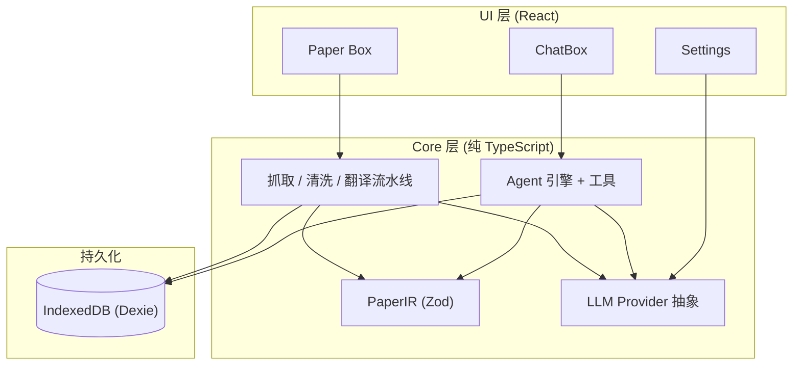
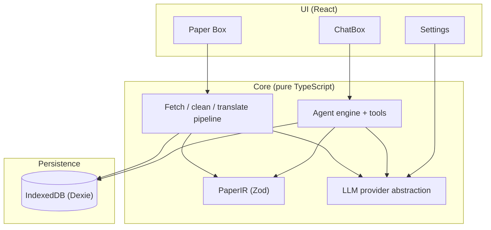

<div align="center">


# ResearchBox

**面向学术研究的 Agent 框架与论文工具箱 · 纯前端 · 本地优先 · 自带 LLM**

在项目上下文中与 AI 协作：检索论文库、外部学术搜索、推荐入库、保存研究产出；可选 Web 搜索与 Python 沙箱。  
**Paper Box** 将 arXiv 论文转为可读、可译、可标注的结构化知识库——一切在浏览器中运行，数据留在你的设备上。

[](https://www.typescriptlang.org/)
[](https://react.dev/)
[](https://vite.dev/)
[](https://web.dev/progressive-web-apps/)
[](#license)
[](https://phantivia.github.io/ResearchBox/)

**简体中文** · [English](#english)

🌐 **在线体验：** [https://phantivia.github.io/ResearchBox/](https://phantivia.github.io/ResearchBox/)

</div>

---

## 目录

- [概览](#概览)
- [核心特性](#核心特性)
- [架构](#架构)
- [ChatBox：Research Agent](#chatboxresearch-agent)
- [Paper Box：论文阅读与翻译](#paper-box论文阅读与翻译)
- [为什么选择 ResearchBox](#为什么选择-researchbox)
- [快速开始](#快速开始)
- [开发与测试](#开发与测试)
- [技术栈](#技术栈)
- [路线图](#路线图)
- [文档](#文档)
- [参与贡献](#参与贡献)
- [作者与许可](#作者与许可)

---

## 概览

ResearchBox 是一款**面向研究人员的纯前端 PWA**，无需后端、无需账号体系，部署为静态站点即可使用。

产品由两条主线构成：

| 模块 | 定位 |
|------|------|
| **ChatBox** | 为学术场景设计的 Research Agent 运行时——多轮工具循环、流式推理、子 Agent、Artifact 持久化 |
| **Paper Box** | Agent 的知识底座——arXiv 抓取、结构化 IR、AI 翻译、原文/译文/双语阅读与标注 |

二者共享 **PaperIR**（Zod 定义的中央数据格式）与 `paperId#blockId` 引用体系。应用以**项目（Project / 工作区）**为顶层组织单位；进入项目后默认落地 ChatBox。

> [!TIP]
> 在线体验无需安装：打开 [GitHub Pages 演示](https://phantivia.github.io/ResearchBox/)，在设置页填入你的 LLM API Key 即可开始。

---

## 核心特性

- 🧠 **Research Agent 引擎** — `runAgent` 多轮工具循环、流式输出、工具审批、子 Agent、超大结果分页；核心在 `src/core/agent/` 以框架无关纯 TypeScript 实现，可单测、可复用
- 📚 **学术工具集** — Paper Box 检索、语义 block 检索、OpenAlex / Semantic Scholar 搜索、论文推荐入库、Artifact 持久化
- 🔀 **采集 / 研究双模式** — 「盒子打开」可向外搜索并推荐论文；「盒子关闭」后 Agent 仅在已整理的 Paper Box 内工作，边界清晰、可审计
- 📄 **Paper Box 阅读器** — arXiv 一键导入、规则清洗 HTML、KaTeX 数学、流式翻译与断点续传、划词标注与引用弹窗
- 🔑 **自带 LLM（BYOK）** — OpenAI、Anthropic、Gemini、DeepSeek、OpenRouter、SiliconFlow 等，用户填写 API Key，无厂商锁定
- 💾 **本地优先** — IndexedDB 持久化论文、会话与 Artifact；可安装为 PWA，支持离线阅读
- 🐍 **可选扩展能力** — Pyodide Python 沙箱、Tavily / Perplexity Web 搜索、客户端 OCR（tesseract.js），均可单独开关并支持审批
- 🧩 **可扩展架构** — `src/core/` 与 UI 严格分离；IR 的 Zod schema 为唯一事实来源

---

## 架构



**设计原则**（详见 [`CLAUDE.md`](./CLAUDE.md)）：

- `src/core/` 不依赖 React，可被 Vitest 在 node/jsdom 环境单测
- UI 只调用 core 暴露的 API，禁止反向依赖
- 所有论文数据读写均经 PaperIR schema，不得另立 interface

---

## ChatBox：Research Agent

ChatBox 不是通用聊天壳，而是围绕**文献调研、论文精读、研究产出**设计的 Agent 运行时。

| 能力 | 说明 |
|------|------|
| **多轮工具循环** | LLM 调用工具 → 执行 → 结果回注 → 继续推理；并发安全工具可并行（上限 4） |
| **流式体验** | 文本、thinking 块、Python 代码、工具卡片实时渲染；后台运行，切页不中断 |
| **工具审批** | Web 搜索、Python、Artifact 写入等敏感操作可配置自动放行或逐项确认 |
| **子 Agent** | `paper-summarizer` / `reviewer` 等专用子任务，独立模型与推理强度 |
| **多模态输入** | 粘贴/拖拽图片，客户端 OCR 提取文字送入对话 |
| **会话持久化** | 历史搜索、重命名、置顶、删除；Artifact 独立浏览页 |
| **上下文计量** | Token 用量条与详情，帮助控制长对话成本 |

### Agent 工具

由 `buildResearchTools()` 组装：

| 工具 | 用途 |
|------|------|
| `paperbox_list` | 列出当前项目已入库论文 |
| `paperbox_read` | 读取 meta / abstract / outline / full |
| `paperbox_fetch` | 全文紧凑纯文本（含 `paperId#blockId` 锚点） |
| `retrieval` | 对 Paper Box 内 blocks 做语义检索（位图预过滤 + LLM side-query） |
| `academic_search` | 外部学术搜索（OpenAlex → Semantic Scholar，可补全摘要） |
| `recommend_papers` | 向用户展示论文推荐卡片，确认后入库 |
| `artifacts` | 保存研究产出（summary / compare-table / outline / note）到 IndexedDB |
| `sub_agent` | 启动子 Agent 执行专项任务 |
| `fetch_result` | 加载超大工具结果的完整内容 |
| `websearch` * | Tavily / Perplexity Web 搜索（需开启 `allowWeb`） |
| `python` * | Pyodide WASM 沙箱执行 Python（需开启 `allowCode`） |

\* 可在设置中开关；涉及外部网络或代码执行的操作支持审批流程。

### 采集 vs 研究

```
┌─────────────────────────────────────────────────────────┐
│  盒子打开（采集）          │  盒子关闭（研究）            │
│  外部 academic_search      │  仅 Paper Box 内检索         │
│  Web 搜索 + 推荐入库       │  retrieval / read / fetch    │
│  扩充论文库                │  写 Artifact、跑 Python      │
└─────────────────────────────────────────────────────────┘
```

关闭盒子时插入边界标记，Agent 系统 Prompt 与可用工具集同步切换——适合「先广泛搜集，再聚焦已有文献」的研究节奏。

**框架实现亮点**（`src/core/agent/`）：

- Zod 工具 Schema：输入/输出类型即契约
- Evidence 与溯源：工具结果带 `paperId#blockId` 引用
- Result Budget：超大输出持久化到 IndexedDB，对话内只保留预览 + `resultId`
- Skills 模板：文献综述、对比表、大纲等 Markdown 技能模板

---

## Paper Box：论文阅读与翻译

Agent 的论文库建立在 **PaperIR** 之上：

- 📥 **一键导入 arXiv** — 支持 `arxiv.org/abs|pdf|html/...` 与裸 ID（含版本号），自动选源与回退
- 🧼 **干净的正文** — 规则清洗 HTML，保留标题层级、公式、图表与引用；**零 LLM 成本**
- 🌐 **原文 / 译文 / 双语** — 分块流式翻译，先出结构后补内容；**断点续传**
- ∑ **KaTeX 数学渲染** — 公式密集页面稳定排版
- ✍️ **划词标注** — 高亮与笔记持久化，跨会话保留
- 🔗 **引用弹窗** — 点击文中引用原地查看参考文献
- 🗂️ **多项目隔离** — 论文条目与标注按项目隔离；`PaperIR` 内容跨项目共享缓存

---

## 为什么选择 ResearchBox

| 维度 | ResearchBox |
|------|-------------|
| **定位** | 学术研究 Agent + 论文工具箱，而非通用 ChatGPT 壳 |
| **部署** | 纯静态 SPA — GitHub Pages / Cloudflare Pages / Vercel，无服务器运维 |
| **数据** | IndexedDB 本地持久化，论文、会话、Artifact 不上传 |
| **LLM** | BYOK，多 Provider 统一抽象 |
| **可扩展** | 框架无关 `src/core/`，Agent 工具、IR、流水线均可单测与二次开发 |

---

## 快速开始

> **环境要求：** Node.js 18+、npm

```bash
git clone https://github.com/phantivia/ResearchBox.git
cd ResearchBox
npm install
npm run dev
```

开发服务器启动后，在浏览器打开本地地址，按以下步骤上手：

1. **配置 LLM** — 设置页填入 Provider 与 API Key（可选：Semantic Scholar / OpenAlex / Web 搜索 Key）
2. **创建项目** — 默认进入 ChatBox，开始文献调研对话
3. **导入论文** — 切换到 Paper Box，粘贴 arXiv 链接；Agent 即可检索、精读已入库内容
4. **切换模式** — 开启「盒子」向外搜索并推荐论文；收集完成后关闭盒子，聚焦已有文献写 Artifact

**生产构建与静态部署：**

```bash
npm run build        # 类型检查 + 生产构建
npm run build:pages  # GitHub Pages 构建（相对路径 base）
npm run preview      # 本地预览构建产物
```

---

## 开发与测试

```bash
npm run typecheck    # TypeScript 类型检查
npm run test         # Vitest 单元测试
npm run test:watch   # Vitest watch 模式
npm run test:e2e     # Playwright E2E
npm run test:e2e:install  # 安装 Playwright Chromium（首次 E2E 前执行）
```

架构约定、模块边界与 Agent 实现细节见 [`PROJECT.md`](./PROJECT.md) 与 [`CLAUDE.md`](./CLAUDE.md)。

---

## 技术栈

| 层次 | 技术 |
|------|------|
| 框架 | React 19 · Vite 6 · TypeScript strict |
| 状态 | Zustand |
| 持久化 | Dexie.js (IndexedDB) |
| 校验 | Zod |
| 样式 | Tailwind CSS |
| 数学 / 安全 | KaTeX · DOMPurify |
| Agent 扩展 | Pyodide · tesseract.js |
| 测试 | Vitest · Playwright |

---

## 路线图

- [x] **Phase 0** — 骨架：项目、存储与 IR 数据模型
- [x] **Phase 1** — Paper Box 只读链路：arXiv 导入 → 清洗 → 渲染 + 数学
- [x] **Phase 2** — 翻译流水线：结构化 IR + 流式译文 + 断点续传 + 双语视图
- [x] **Phase 3** — 阅读体验：标注持久化、引用弹窗
- [x] **Phase 4** — ChatBox Research Agent：工具循环、学术搜索、检索、Artifact、子 Agent、Python 沙箱
- [ ] **Phase 5** — 打磨与上架：离线体验优化、配额管理、安卓 TWA 打包
- [ ] **未来** — PDF 导入管线、Skills 菜单接入、更多子 Agent 类型

---

## 文档

| 文档 | 内容 |
|------|------|
| [`ResearchBox-技术手册.md`](./ResearchBox-技术手册.md) | 产品定位、功能说明、用户向技术细节 |
| [`PROJECT.md`](./PROJECT.md) | 开发手册：目录结构、模块接口、Agent 架构 |
| [`CLAUDE.md`](./CLAUDE.md) | 贡献约定与技术栈铁律 |

---

## 参与贡献

欢迎 Issue 与 Pull Request。提交前请确保：

1. 遵守 [`CLAUDE.md`](./CLAUDE.md) 中的架构铁律（core/UI 分离、PaperIR 为唯一 schema 来源）
2. 本地通过 `npm run typecheck` 与 `npm run test`
3. 涉及 Agent 或 core 模块的改动，补充或更新同名 `.test.ts`

---

## 作者与许可

**PhantAIStudio**

- **Author:** [Phantivia](mailto:phantivia@gmail.com)
- **License:** [MIT](./LICENSE)

<div align="center">

<sub>Vibe Coiding太好用了，你们知道吗？———— Phant(除了这句话之外没有写任何东西之人)</sub>

[⬆ 回到顶部](#researchbox) · [English](#english)

</div>

---

<a id="english"></a>

<div align="center">


# ResearchBox

**An agent framework & paper toolbox for academic research · Frontend-only · Local-first · BYOK**

Collaborate with AI in project context: search your paper library, run external academic search, recommend papers for import, and save research artifacts—with optional web search and a Python sandbox.  
**Paper Box** turns arXiv papers into a readable, translatable, annotatable structured knowledge base. Everything runs in your browser; data stays on your device.

[](https://www.typescriptlang.org/)
[](https://react.dev/)
[](https://vite.dev/)
[](https://web.dev/progressive-web-apps/)
[](#license-1)
[](https://phantivia.github.io/ResearchBox/)

[简体中文](#researchbox) · **English**

🌐 **Live demo:** [https://phantivia.github.io/ResearchBox/](https://phantivia.github.io/ResearchBox/)

</div>

---

## Table of Contents

- [Overview](#overview)
- [Key Features](#key-features)
- [Architecture](#architecture-1)
- [ChatBox: Research Agent](#chatbox-research-agent)
- [Paper Box: Reading & Translation](#paper-box-reading--translation)
- [Why ResearchBox](#why-researchbox)
- [Quick Start](#quick-start)
- [Development & Testing](#development--testing)
- [Tech Stack](#tech-stack)
- [Roadmap](#roadmap)
- [Documentation](#documentation)
- [Contributing](#contributing)
- [Author & License](#author--license)

---

## Overview

ResearchBox is a **frontend-only PWA for researchers**—no backend, no account system, deployable as a static site.

Two product lines:

| Module | Role |
|--------|------|
| **ChatBox** | Research Agent runtime for academic workflows—multi-turn tool loop, streaming, sub-agents, Artifact persistence |
| **Paper Box** | Knowledge foundation for the agent—arXiv fetch, structured IR, AI translation, original/translation/bilingual reading with annotations |

Both share **PaperIR** (Zod-defined central format) and `paperId#blockId` citations. The app is organized around **Projects (workspaces)**; entering a project lands on ChatBox by default.

> [!TIP]
> Try it without installing: open the [GitHub Pages demo](https://phantivia.github.io/ResearchBox/) and add your LLM API key in Settings.

---

## Key Features

- 🧠 **Research Agent engine** — Multi-turn tool loop, streaming, tool approval, sub-agents, paginated large results; core logic in framework-agnostic TypeScript under `src/core/agent/`
- 📚 **Academic toolset** — Paper Box search, semantic block retrieval, OpenAlex / Semantic Scholar search, paper recommendation & import, Artifact persistence
- 🔀 **Collect vs. research modes** — With the “box open”, search externally and recommend papers; with the “box closed”, work only inside your curated Paper Box
- 📄 **Paper Box reader** — One-click arXiv import, rule-based HTML cleaning, KaTeX math, streaming translation with resume, inline annotations and citation popovers
- 🔑 **Bring your own LLM** — OpenAI, Anthropic, Gemini, DeepSeek, OpenRouter, SiliconFlow, and more
- 💾 **Local-first** — IndexedDB persistence; installable PWA with offline reading
- 🐍 **Optional extensions** — Pyodide Python sandbox, Tavily / Perplexity web search, client-side OCR (tesseract.js)—each toggleable with approval flow
- 🧩 **Extensible architecture** — Strict core/UI separation; PaperIR Zod schema as single source of truth

---

## Architecture



See [`CLAUDE.md`](./CLAUDE.md) for architecture rules: core has no React dependency; UI calls core only; all paper data flows through PaperIR.

---

## ChatBox: Research Agent

ChatBox is an agent runtime built around **literature survey, close reading, and research output**—not a generic chat shell.

| Capability | Description |
|------------|-------------|
| **Multi-turn tool loop** | LLM → tools → results → continue; concurrency-safe tools run in parallel (up to 4) |
| **Streaming UX** | Text, thinking blocks, Python code, tool cards in real time; background runs survive navigation |
| **Tool approval** | Sensitive ops (web search, Python, Artifact writes) can auto-approve or require confirmation |
| **Sub-agents** | Tasks like `paper-summarizer` / `reviewer` with separate model and reasoning settings |
| **Multimodal input** | Paste/drag images; client-side OCR extracts text for the conversation |
| **Session persistence** | Search history, rename, pin, delete; dedicated Artifact browse page |
| **Context meter** | Token usage bar and details for long conversations |

### Agent tools

Assembled by `buildResearchTools()`:

| Tool | Purpose |
|------|---------|
| `paperbox_list` | List papers in the current project |
| `paperbox_read` | Read meta / abstract / outline / full |
| `paperbox_fetch` | Compact full-text with `paperId#blockId` anchors |
| `retrieval` | Semantic search over Paper Box blocks |
| `academic_search` | External search (OpenAlex → Semantic Scholar) |
| `recommend_papers` | Show recommendation cards; user confirms import |
| `artifacts` | Persist research output to IndexedDB |
| `sub_agent` | Spawn sub-agents for focused tasks |
| `fetch_result` | Load full content of oversized tool results |
| `websearch` * | Tavily / Perplexity (requires `allowWeb`) |
| `python` * | Pyodide WASM sandbox (requires `allowCode`) |

### Collect vs. research

```
┌─────────────────────────────────────────────────────────┐
│  Box open (collect)        │  Box closed (research)     │
│  External academic_search  │  Paper Box retrieval only  │
│  Web search + recommend    │  read / fetch / artifacts  │
│  Grow the library          │  Python analysis           │
└─────────────────────────────────────────────────────────┘
```

Framework highlights in `src/core/agent/`: Zod tool schemas, `paperId#blockId` provenance, result budget for large outputs, skill templates for literature workflows.

---

## Paper Box: Reading & Translation

Built on **PaperIR**:

- 📥 **One-click arXiv import** — Links and bare IDs with automatic source selection
- 🧼 **Clean reading view** — Rule-based HTML cleaning; **zero LLM cost** for parsing
- 🌐 **Original / translation / bilingual** — Chunked streaming translation; **resume from checkpoint**
- ∑ **KaTeX math** — Stable layout on equation-heavy pages
- ✍️ **Inline annotation** — Highlights and notes persist across sessions
- 🔗 **Citation popovers** — In-place reference viewing
- 🗂️ **Per-project isolation** — Entries and annotations isolated; shared `PaperIR` cache

---

## Why ResearchBox

| Dimension | ResearchBox |
|-----------|-------------|
| **Focus** | Academic research agent + paper toolbox, not a generic ChatGPT shell |
| **Deploy** | Static SPA — GitHub Pages / Cloudflare Pages / Vercel |
| **Data** | IndexedDB local persistence; papers, sessions, artifacts never uploaded |
| **LLM** | BYOK; unified multi-provider abstraction |
| **Extensible** | Framework-agnostic `src/core/`; unit-testable tools, IR, and pipelines |

---

## Quick Start

> **Requirements:** Node.js 18+, npm

```bash
git clone https://github.com/phantivia/ResearchBox.git
cd ResearchBox
npm install
npm run dev
```

**Getting started:**

1. **Configure LLM** — Add Provider and API key in Settings (optional: Semantic Scholar / OpenAlex / web search keys)
2. **Create a project** — Lands on ChatBox; start a literature survey conversation
3. **Import papers** — Switch to Paper Box, paste an arXiv link; the agent can search and read imported papers
4. **Switch modes** — Keep the box open to search externally; close it to focus on your library and write Artifacts

**Production build:**

```bash
npm run build        # typecheck + production build
npm run build:pages  # GitHub Pages build (relative base)
npm run preview      # preview locally
```

---

## Development & Testing

```bash
npm run typecheck
npm run test
npm run test:watch
npm run test:e2e
npm run test:e2e:install
```

See [`PROJECT.md`](./PROJECT.md) and [`CLAUDE.md`](./CLAUDE.md) for module boundaries and Agent architecture.

---

## Tech Stack

| Layer | Stack |
|-------|-------|
| Framework | React 19 · Vite 6 · TypeScript strict |
| State | Zustand |
| Persistence | Dexie.js (IndexedDB) |
| Validation | Zod |
| Styling | Tailwind CSS |
| Math / safety | KaTeX · DOMPurify |
| Agent extensions | Pyodide · tesseract.js |
| Testing | Vitest · Playwright |

---

## Roadmap

- [x] **Phase 0** — Skeleton: projects, storage, IR data model
- [x] **Phase 1** — Paper Box read path: arXiv import → cleaning → rendering + math
- [x] **Phase 2** — Translation pipeline: structured IR + streaming translation + resume + bilingual views
- [x] **Phase 3** — Reading UX: annotation persistence, citation popovers
- [x] **Phase 4** — ChatBox Research Agent: tool loop, academic search, retrieval, Artifacts, sub-agents, Python sandbox
- [ ] **Phase 5** — Polish & ship: offline UX, quota management, Android TWA packaging
- [ ] **Future** — PDF import pipeline, Skills menu, more sub-agent types

---

## Documentation

| Doc | Contents |
|-----|----------|
| [`ResearchBox-技术手册.md`](./ResearchBox-技术手册.md) | Product positioning, features, user-facing technical details |
| [`PROJECT.md`](./PROJECT.md) | Developer handbook: structure, modules, agent architecture |
| [`CLAUDE.md`](./CLAUDE.md) | Contribution conventions and stack rules |

---

## Contributing

Issues and pull requests are welcome. Before submitting:

1. Follow architecture rules in [`CLAUDE.md`](./CLAUDE.md)
2. Pass `npm run typecheck` and `npm run test` locally
3. Add or update `.test.ts` for core / Agent changes

---

## Author & License

**PhantAIStudio**

- **Author:** [Phantivia](mailto:phantivia@gmail.com)
- **License:** [MIT](./LICENSE)

<div align="center">

[⬆ Back to top](#english) · [简体中文](#researchbox)

</div>
